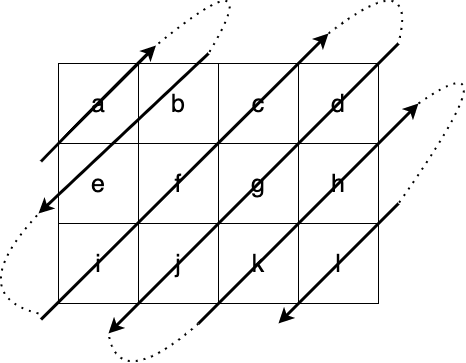

# Diagonal Traversal - Optional Problem

Given a matrix of M x N elements (M rows, N columns), return all elements of the matrix in diagonal order as shown in the below image.

Input:

```ruby
[
  ['a', 'b', 'c', 'd'],
  ['e', 'f', 'g', 'h'],
  ['i', 'j', 'k', 'l'],
]
```

Return value:

```ruby
['a', 'b', 'e', 'i', 'f', 'c', 'd', 'g', 'j', 'k', 'h', 'l']
```

<!-- Image source 
https://drive.google.com/file/d/11SbGbOfT0m7d2Fmhs5xMYl61M9rIiVbA/view?usp=sharing
-->




